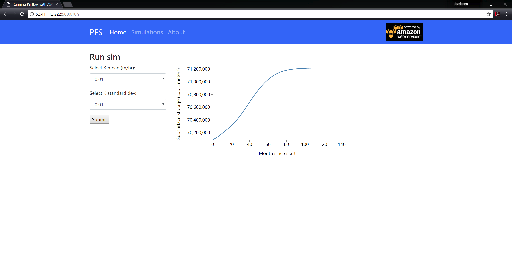

# ParFlowApp
Web app for ParFlow with Flask and Docker (In progress). 

This project allows the user to select a hydraulic conductivity value. This parameter is used as input for ParFlow.CLM which runs in a Docker container. A D3.js graph of the subsurface storage is produced from the model outputs.

